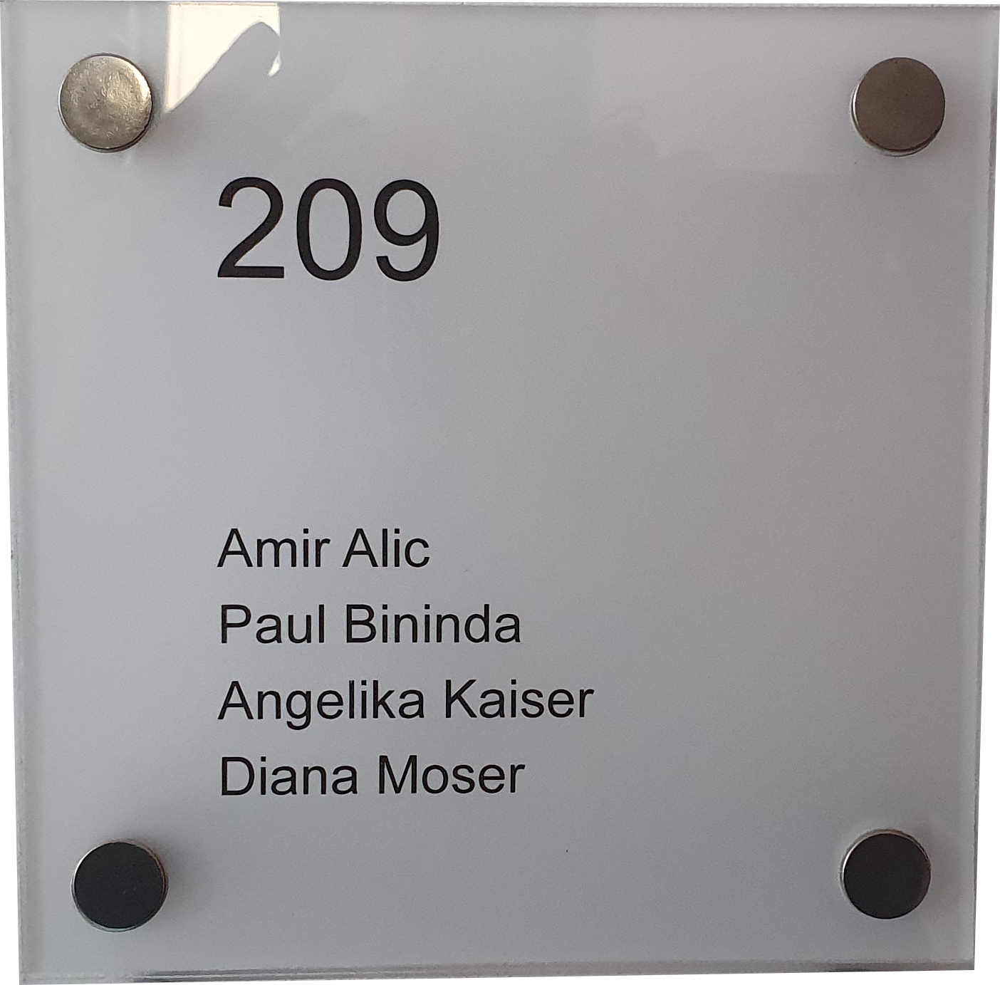

# UWESSNAEWEEN

*Uwe soll sich nicht ärgern. Wir entwickeln etwas neues.*

&emsp;&emsp;&emsp;

## Problembeschreibung

Uwe muss immer wenn sich die Belegung der Räume ändert, die Türschilder ändern. Das ist ein aufwendiger nerviger Prozess.

Beim Besprechungsraum wäre es schön, wenn man sehen könnte wann und für wen der Raum in den nächsten Stunden reserviert ist. Bei einer laufenden Besprechung wäre es schön, wenn man sehen könnte welche Mitarbeiter gerade in der Besprechung sind, falls man jemanden sucht.

Insgesamt haben wir bei SEKAS ca. 20 Türschilder.

## Mögliche Lösung

EInk-Displays an/neben den Türen. Die Displays sollten

* Batteriebetrieben sein (Lebensdauer 1 Jahr tbd.)
* Eine übersichtliche Seite mit Informationen zum Raum anzeigen
* Sich über WiFi regelmäßig aktualisierte Informationen beschaffen
* Ein formschönes Gehäusedesign haben
* Die Aktualisierungen sollten zentral gemanaged werden
* Updateintervalle sollten variabel sein (Einfluss auf Lebensdauer)

*Ganz grobe BOM-Kosten*:

* 800x600 6" EInk Display 2 Color: 36$
* 800x448 5.83" EInk Display 3 Color: 40$
* Driver Board (off the shelf): 8$
* Total BOM: ~60$

## Projekitphasen

### Klärung SEKAS-Beteiligung

* Budget Material
* Bestellwesen
* Bereitstellung von Räumlichkeiten
* Beretistellung von Pizza
* Versicherung, Haftung

### Teambildung

* Wer hat Lust mitzumachen?
* Wer kann welche Fähigkeiten einbringen?
* Wer kann wie viel Zeit einbringen?
* Wer kann welche Rollen übernehmen?
* Wer möchte am Ende auch Exemplare für zu Hause?

### Skills

* Firmware-Entwicklung
* Backend-Entwicklung
* EE-Design
* Board-Layout
* Mechanisches Design
* Supply-Chain
* Fertigung (Löten, Mechanischer Zusammenbau)
* Industrial Design
* PM

### Anforderungsdefinition

* Was soll auf den Türschildern dargestellt werden?
* Was sind die Anforderungen bzgl. Updaterate?
* Was sind die Anforderrungen bzgl. Batterielebensdauer?
* Was ist der Kostenrahmen?

### Machbarkeitsuntersuchung

* Sind die Ziele bezüglich Lebensdauer der Batterien machbar?
* Wie hoch sind die Materialkosten ungefähr (BOM, pro Schild)
* Wie klein bekommen wir die Steuerungslogik

### Platformauswahl

* Welchen Prozessor verwenden wir?
* Was für eine Entwicklungsplattform nutzen wir?
* Nutzen wir eine IoT-Platform oder fangen wir erst mal mit den Basics an?

### Hardware Design

* Leiterplattendesign
* Gehäusedesign
* Batteriefach
* Aufhängung

### Hardware Prototyp

* Handfertigung einer Leiterplatte oder Bestellung über ein Board-House
* Bestückung
* Gehäusefertigung (3D-Print)
* Iterationen

### Software Design und Implementierung

Parallel zu Hardware-Prototyp

* Firmware
* Backend
* Iterationen

### Produktion

* Bestellung Leiterplatten
* Bestückung (in-House / Auftragsfertigung?)
* Programming (Firmware aufspielen)
* Gehäuse (Injection Mold / 3D Print)
* Endmontage

### Deployment

* Anbringen an den Türen
* Installation / Rollout Backend Software

## Links

### Beispielprojekt ESP8266 Light Strip

https://github.com/pbininda/ESP8266LightStrip

### Waveshare E-Ink Displays

https://www.waveshare.com/product/displays/e-paper/epaper-1.htm

€38.84 für "raw display"

49.95 für "display mit HAT"

### ESP8266 Bei Mouser

https://www.mouser.de/Embedded-Solutions/Wireless-RF-Modules/WiFi-Modules-80211/_/N-6l7qa?Keyword=esp8266&FS=True

https://www.mouser.de/ProductDetail/Espressif-Systems/ESP-WROOM-02D-4MB?qs=sGAEpiMZZMsRr7brxAGoXSSUPDSAjAiVMDdZTQMS1OoLsk1Mo9acAg%3D%3D

Einzel-Stückpreis €2,88

### ESP8266 Bei Ali Express

https://de.aliexpress.com/item/32641565241.html

Einzel-Stückpreis €1,08

### Boards

5 Boards: $2.00

Shipping:
* $6 (7-10 Werktage)
* $21 (DHL Express, 2-3 Werktage)

https://jlcpcb.com/

### Die Konkurenz

https://www.digitales-tuerschild.de/1_12_Digitale_Tuerschilder.php

https://shop.kindermann.de/erp/webshop/navigationPath/100000.Produkte/117250.Raumbuchung/105055.Doorsigns

https://shop.kindermann.de/erp/KCO/avs/Katalogseiten/2019/Katalog_60+61+62.pdf

* Doorsign e-Ink 7,4 Zoll schwarz/weiß/rot €179,00

* e-Ink Wireless Accesspoint €625,00
* Netzteil für e-Ink Accesspoint €35,00
* Wandhalterung aus Edelstahl €25,00